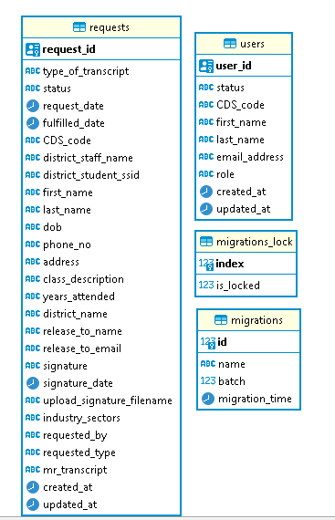
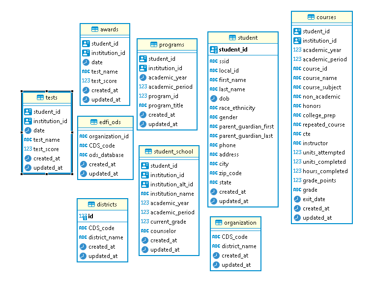

# General Software Design Notes

This readme contains some notes and tips for developers
regarding the overalls of project structure

## Folder Layout and content

The main folders of the project are 
described [here](../README.md)

### Dependency between folders

The figure below describes the interdependency
between folders

```
design (depends_on)
    > None

docs (depends_on)
    > None

email-utils (depends_on)
    > None

pdf-utils (depends_on)
    > security

scripts (depends_on)
    > None

transcript-api (depends_on)
    > pdf-utils
    > email-utils
    > transcript-backend

transcript-backend (depends_on)
    > None

verification-api (depends_on)
    > pdf-utils

web-client (depends_on)
    > None
```

## Modules and CLI

The code for the project has been separated into several 
modules. Most of these modules have a CLI interface such
that they can be tested via the command line independently.

The CLI tools can be run by simply passing the corresponding
script to node

For example,
```bash
cd transcript-backend
node cli/transcript-cli.js

Output:

$ node cli/transcript-cli.js 
Usage: standard-transcript [options] [command]

CLI for Standard Transcript Generator

Options:
  -V, --version                                                                           output the version number
  -h, --help                                                                              display help for command

Commands:
  query-composite [compositeName]                                                         Query a specific composite (educationOrganizationHierarchy, studentTranscript
  query-transcript-by-student-id [studentId]                                              Query standard transcript provided a studentId
  query-transcript-by-student-demographics [firstName] [lastName] [dateOfBirth]           Query standard transcript provided student demographics (firstName, lastName, dob in yyyy-mm-dd)
  render-standard-transcript-pdf [fileName] [destination]                                 Renders a standard transcript pdf given a file with a JSON trancript
  validate-standard-json [fileName]                                                       Validates whether a json file fits a standard transcript
  handlebar-model-for-standard [fileName]                                                 Creates handlebar model for standard json. Pass path to standard
  composite-to-standard [transcriptFile] [enrollmentsFile] [educationalOrganizationFile]  Prints standard JSON for the given composite files
  help [command]                                                                          display help for command


```

### Setting Up dot-env (.env)

Before running these CLI Commands, make sure that you
have configured the dotenv file

For example
```bash
# Email Utils
cd email-utils

cp .env.example .env
$ cat .env
SMTP_HOST=${SDCOE_SMTP_HOST}
SMTP_PORT=${SDCOE_SMTP_PORT}
SMTP_AUTH_USER=${SDCOE_SMTP_AUTH_USER}
SMTP_AUTH_PASSWORD=${SDCOE_SMTP_AUTH_PASSWORD}
SMTP_FROM=${SDCOE_SMTP_FROM}
STATIC_PATH=${SDCOE_STATIC_PATH}
MAIL_TO=${SDCOE_EMAIL}

# Configure email-utils by change the values of the variables 
# seen above
nano .env
```

## Tech stack

The main tools and frameworks 
used in this project are listed below

### Node Libraries
|Tool|Version|Purpose|
|----|-------|-------|
|nodejs|14|Serverside javascript framework|
|express|4.17|back end web application framework for Node.js|
|Ganache CLI|v6.12.1|a personal Ethereum blockchain simulator|
|knex|0.21|SQL query builder for Postgres, MSSQL ...|
|commander|6.1|node.js command-line interfaces|
|handlebars|4.7|templating language which uses a template and an input object to generate HTML.|
|winston|3.3.3|Logging facilitator|
|nodemailer|6.4|a module for Node.js to send emails|
|puppeteer|5.5|provides a high-level API to control Chrome or Chromium|

### Front End
|Tool|Version|Purpose|
|----|-------|-------|
|reactjs|17.0|front end, JavaScript library for building user interfaces or UI components|
|axios|0.21|HTTP client for the browser and node.js|

### Database

|Tool|Version|Purpose|
|----|-------|-------|
|postgres|12.5|database|

### Blockchain libraries

|Tool|Version|Purpose|
|----|-------|-------|
|ethr-did|v1.1.0|This library is used to use Ethereum addresses as fully self-managed `Decentralized Identifiers (DIDs)`. It allows us to easily create and manage keys for these identities|
|ethr-did-resolver|v0.2.0|This library is used to use Ethereum addresses as DIDs and resolve the `DID document` from the Ethereum addresses|
|web3|v1.3.0|[web3](https://web3js.readthedocs.io/en/v1.3.0/) is a library that allows us to interact with a local or remote ethereum node using HTTP, IPC or WebSocket|
|ganache-core|v2.13|Ganache-core is an Ethereum simulator that includes most functions and features of Etheruem Mainnet and can be run deterministically to persist data between multiple runs. We use it in web3.<br/>This package is not required in SDCOE if we use the already deployed ethr-did-registry smart contract in the public Ethereum network|
|@rsksmart/ethr-did-utils|v1.1.0|This package is used to deploy [`ethr-did-registry`](https://github.com/uport-project/ethr-did-registry) smart contract to the Ganache Ethereum instance.<br/>This package is not required in SDCOE if we use the already deployed ethr-did-registry smart contract in the public Ethereum network|


### Scripts

|Tool|Version|Purpose|
|----|-------|-------|
|bash|5.0.17|Installation of tools on linux|
|vagrant|2.2.6|Virtual box provisioning for local deployment|

## About Database

The migration scripts for creating the tables are present in
`transcript-api/migrations`

The migration script creates the tables. In order to run the script
do the following:

```
# Make sure you have a database called "sdcoe"
cd transcript-api
yarn migrate
```


The following tables are in use at the moment (Feb 4, 2021)



The following tables are not in use at the moment (Feb 4, 2021)




## Trivia

### Why are there so many node packages

When this project was started, we did not
know the requirements perfectly. 
We did not know the all components
that would go into this repository. 
Therefore, we decided to first develop packages
that we were sure of. As such we have multiple 
node packages.

The node packages can be set as dependency of
another package simply by setting the path
of the dependent package in a package.json file

```
# eg package.json snippet

dependencies: {
  ...,
  'transcript-backend':'../transcript-backend'
  ...
}
```

### Order in which things were developed (history)

We started by writing the email-utils module.
Then as we became more certain of the 
blockchain and the transcript verification process,
we built the security and the
pdf-utils. We then worked on the transcript-api 
and the web-client such that we had a barely demoable
web application. Followed by that we wrote the 
verification api and fixed the verification api
web application. 

Meanwhile the SDCOE team was working on developing
the standard for the transcript. Once that was done,
a transcript-backend module was created that deals
with retrieving data from composite API and creating
the standard transcript. Lastly, the script folder
was developed to contain deployment and schedule
related scripts


